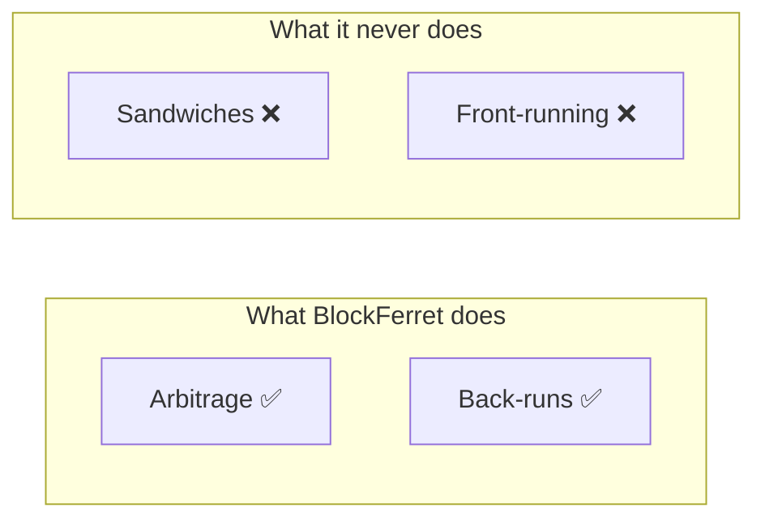
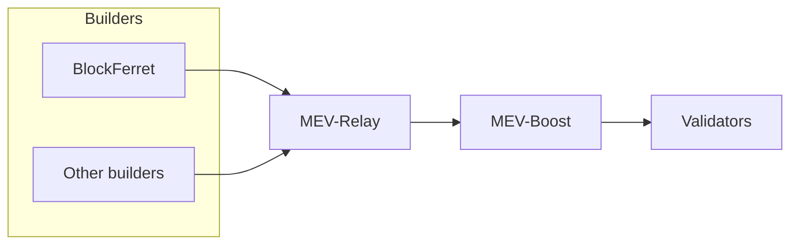

# BlockFerret — Vouch's Builder

**BlockFerret** is the ethical MEV builder of the Vouch stack, built in the [Switch.win](https://switch.win) × [Vouch.run](https://vouch.run) alliance. It is the builder that Vouch itself operates and connects to the [MEV-Relay](./mev_relay).

A builder is the machine that assembles blocks and bids for them. BlockFerret is ours.

- **Website:** <https://blockferret.win>
- **Role:** a builder connected to the Vouch MEV-Relay, bidding for PulseChain blockspace.
- **Ethics:** arbitrage and back-runs only — never sandwiches, never front-running.

## Why an alliance?

Two community projects, one shared commitment: build MEV infrastructure that competes hard without harming the people using the chain. Shared values, shared upside.

## Ethical MEV, defined

BlockFerret captures **arbitrage** and **back-runs**:

- **Arbitrage** — profiting from price differences across markets, which also keeps prices aligned.
- **Back-runs** — riding the price move *after* a large trade, without affecting that trade.

It does **not** sandwich and it does **not** front-run users. Fair execution for users; the ecosystem keeps the value instead of handing it to extractors.

## How it fits the stack

BlockFerret is one of several builders bidding through the [MEV-Relay](./mev_relay). The relay is permissionless and neutral — BlockFerret competes on the same terms as every other builder. When it wins a slot, its payment flows to the validator's fee recipient — for Vouch validators, into the wider ecosystem.

## How value flows

Validators keep their priority fees. The builder uplift is shared back with the builder and Vouch — directionally aligned with the community, with exact splits finalised separately.

## Transparency

BlockFerret's delivered blocks are publicly visible like everyone else's. Filter the [delivered-blocks explorer](https://boost-relay.vouch.run/mevblocks) by builder to see its activity.

## Learn more

- **BlockFerret website:** <https://blockferret.win>
- [MEV-Relay (Builders)](./mev_relay) — the auction BlockFerret bids through.
- [MEV Stack Overview](./overview) — the full picture.
