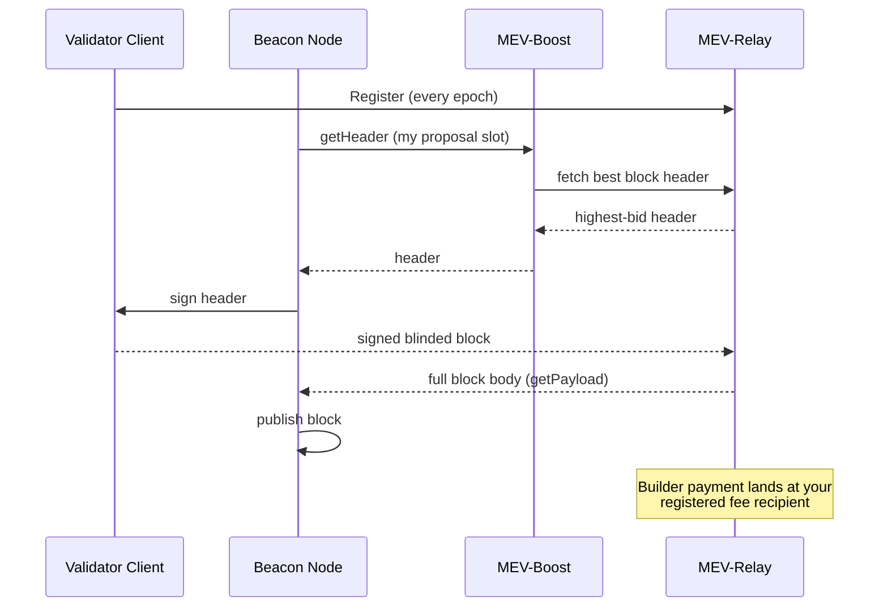

# MEV-Boost for Validators

MEV-Boost is a lightweight sidecar that runs alongside your validator. When your validator is selected to propose a block, instead of building the block itself, it asks the Vouch MEV-Relay for the best block available and signs the winning header.

- **Keep your rewards** — block rewards, priority fees, and the builder's MEV uplift.
- **No key changes** — your validator keys and fee recipient stay exactly as they are.
- **Safe by default** — if no bid comes back, your node falls back to building blocks locally, exactly as it does today.

You do **not** need to be a Vouch validator to use it — any PulseChain validator can point at the relay.

## How a proposal flows



## Prerequisites

- A synced PulseChain **beacon node** and **validator client** (Lighthouse-Pulse or Prysm-Pulse).
- Outbound HTTPS only (to the relay) — **no inbound ports** are needed.
- Docker with Docker Compose.

::: warning Set the gas limit explicitly
Both PulseChain consensus clients default to a **30M** gas limit while the network runs at **~45M** (elastic). Without the explicit gas-limit flag, every MEV-Boost block is built at 30M — **~33% of block space wasted on every proposal**. Set it on **both** the beacon node and the validator client.
:::

## Quickstart

Run the sidecar from a fresh directory with one command:

```bash
mkdir -p mev-boost && cd mev-boost && \
  curl -fsSLO https://raw.githubusercontent.com/Vouchrun/mev-boost/pulse/ops/docker-compose.yml && \
  curl -fsSLO https://raw.githubusercontent.com/Vouchrun/mev-boost/pulse/ops/mev-boost-config.example.yaml && \
  docker compose up -d
```

This pulls `ghcr.io/vouchrun/mev-boost:pulse` and starts the sidecar on port **18550**. With a repository checkout instead: `cd ops && docker compose up -d`.

The sidecar alone does nothing until your beacon node points at it and the gas-limit flag is set — continue below.

::: tip Vouch validators
If you run a validator in the Vouch ecosystem, your fee recipient must remain the **ValidatorFeeDepositor (VFD)**. MEV payouts from winning bids flow through the protocol exactly like priority fees do today. Set your validator client's `suggested-fee-recipient` to:

```text
0x9325008eE3B5982c10010C8f12b6CD4943F48fA6
```

See the [Validator Guide](/docs/validator_guide/getting_started) for the full setup.
:::

## Point your consensus client at the sidecar

:::tabs

== Lighthouse-Pulse
```bash
# Beacon node
lighthouse bn --builder http://localhost:18550 ...

# Validator client
lighthouse vc --builder-proposals --gas-limit 45000000 ...
```

== Prysm-Pulse
```bash
# Beacon node
--http-mev-relay=http://localhost:18550

# Validator client
--enable-builder --suggested-gas-limit=45000000
```

:::

## Apply and restart order

1. **Check no proposer duty is imminent** before restarting: query proposer duties (`/eth/v1/validator/duties/proposer/{epoch}`) and wait for any duty slot to pass.
2. Make sure the MEV-Boost sidecar is running first.
3. Restart the **beacon node** (with the builder endpoint flag).
4. Restart the **validator client** (with the builder + gas-limit flags).

The sidecar must be up before the beacon node points at it.

## Verify it is working

1. **Sidecar startup** — with `-relay-check` (included in the compose file) the log shows whether the relay passed its health check.
2. **Registration visible** — your validator re-registers with the relay every epoch. Confirm it via the data API:

   ```bash
   curl -s "https://boost-relay.vouch.run/relay/v1/data/validator_registration?pubkey=<YOUR_VALIDATOR_PUBKEY>"
   ```

3. **First delivered block** — after your first post-change proposal, check the bid traces:

   ```bash
   curl -s "https://boost-relay.vouch.run/relay/v1/data/bidtraces/proposer_payload_delivered?proposer_pubkey=<YOUR_VALIDATOR_PUBKEY>"
   ```

   - `gas_limit` should be ~45,000,000 — this proves the gas-limit flag took effect.
   - `proposer_fee_recipient` is the fee recipient configured in your validator client.
4. **No curl?** Browse the public delivered-blocks explorer at <https://boost-relay.vouch.run/mevblocks>.

## Useful settings

- **Bid floor** — the reference compose ships `-min-bid=2000` (a 2000 PLS floor; the flag is denominated in PLS, converted to wei). Slots whose best relay bid is below the floor build locally instead. Set `-min-bid=0` to accept any bid.
- **WAN relays** — if your validator is a WAN hop away from the relay, two timeouts matter:
  - `-request-timeout-getheader=3000` (already set in the compose file) is the HTTP client timeout.
  - `timeout_get_header_ms` (default 950 ms) is the per-request context budget and is settable **only via a config file**. On a WAN path, use the downloaded `mev-boost-config.example.yaml` as your `config.yaml`, remove the `-relay=` command line, and add `- -config=/etc/mev-boost/config.yaml` plus a volume mount `./config.yaml:/etc/mev-boost/config.yaml:ro`.
  - **Keep-alive** is on by default (`-relay-keepalive-ms`, default `30000`); it keeps the connection warm so getHeader answers inside the beacon node's 1 s cutoff instead of silently falling back to local building.
- **Metrics** — `-metrics` is in the compose file; metrics are served on `localhost:18551` (loopback only).

## Rollback

```bash
docker compose down
```

Then remove the builder and gas-limit flags from the beacon node and validator client and restart both. Your validator returns to pure local block building — no key or fee-recipient changes are involved.

## Resources

- [Vouchrun/mev-boost](https://github.com/Vouchrun/mev-boost) — source, ops guide, and reference configs (`pulse` branch).
- [Delivered-blocks explorer](https://boost-relay.vouch.run/mevblocks) — public transparency.
- [MEV-Relay (Builders)](./mev_relay) — the other side of the auction.
