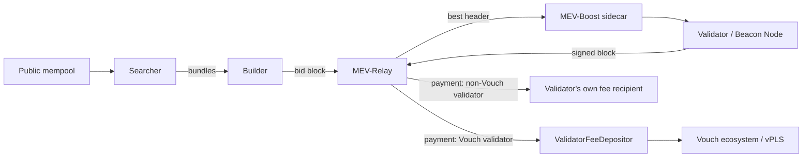

# The Vouch MEV Stack

MEV (Maximal Extractable Value) is the value available in the ordering of transactions inside a block. On every block someone captures it — the only questions are **who** captures it and **how** they behave while doing it.

The Vouch MEV stack is the infrastructure that decides this on PulseChain. It routes block building through an open, competitive auction and sends the value back to the validators, the vPLS community, and everyday users — instead of to extractors.

## How it fits together

1. A **Searcher** watches the mempool for profitable opportunities and packages them into bundles.
2. A **Builder** assembles the most valuable block it can from those bundles and the public mempool, and bids for it.
3. The **MEV-Relay** runs a neutral auction: many builders compete, the highest valid bid wins.
4. The validator's **MEV-Boost** sidecar asks the relay for the best block header and the validator signs it.
5. The winning builder's payment lands at the validator's **registered fee recipient**:
   - **Vouch validators** register the **ValidatorFeeDepositor (VFD)**, so the payment flows into the Vouch ecosystem and on to vPLS holders.
   - **Non-Vouch validators** register their own address, so they keep the payment directly.

## The three components

| Component | What it is | Who it's for | One-liner |
|---|---|---|---|
| [MEV-Boost](./mev_boost) | A lightweight sidecar that runs next to a validator. | Validators | *Any validator. Keep your rewards, add the uplift.* |
| [MEV-Relay](./mev_relay) | The neutral auction builders bid through. | Builders | *Any builder. Open competition for every block.* |
| [BlockFerret](./blockferret) | The Switch.win × Vouch alliance MEV builder. | The Vouch ecosystem | *Ethical building. No sandwiches, ever.* |

## Ethics and neutrality

MEV is unavoidable. Vouch's approach is to make it transparent and fair rather than to censor it:

- **The relay stays permissionless and credibly neutral** — open to every validator and every builder, with no allowlist and no favourites.
- **BlockFerret, the alliance builder, is where the ethics live** — it captures arbitrage and back-runs, and never sandwiches or front-runs users.

## Public transparency

Every payload the relay delivers is publicly visible. Anyone can audit the flow at the [delivered-blocks explorer](https://boost-relay.vouch.run/mevblocks).

## Where do you fit in?

- **I'm a validator** and want more from my proposals → [MEV-Boost (Validators)](./mev_boost)
- **I'm a builder** and want to bid for blockspace → [MEV-Relay (Builders)](./mev_relay)
- **I'm a searcher** and want to submit bundles → [Searchers (Submit Bundles)](./searchers)
- **I want to understand the alliance builder** → [BlockFerret](./blockferret)
