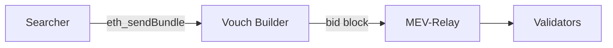

# Searchers — Submit Bundles

A **searcher** watches the mempool for profitable opportunities (arbitrage, back-runs, liquidations) and packages them into atomic **bundles**. Submitting those bundles is how searcher order flow reaches a builder.

On Vouch, bundles are submitted to the **Vouch Builder** — the builder behind `builder.vouch.run`. It assembles blocks from those bundles and bids through the [MEV-Relay](./mev_relay).

::: warning This is the Vouch Builder — not BlockFerret
Bundle submission goes to the **Vouch Builder**. [BlockFerret](./blockferret) is the separate Switch.win × Vouch **alliance** builder. (Bundle submission to BlockFerret is not currently available.)
:::

## How it fits the stack



## Endpoint and method

- **Endpoint:** `POST https://builder.vouch.run`
- **Method:** `eth_sendBundle` (JSON-RPC 2.0) — this is the only method the edge accepts.

```json
{
  "jsonrpc": "2.0",
  "id": 1,
  "method": "eth_sendBundle",
  "params": [{
    "txs": ["0x..."],
    "blockNumber": "0x1A2B3C",
    "minTimestamp": 0,
    "maxTimestamp": 0,
    "revertingTxHashes": []
  }]
}
```

## Authentication

Requests are authenticated with the standard Flashbots signature scheme:

- Header: `X-Flashbots-Signature: <0x-address>:<0x-signature>`
- The signature is over `keccak256` of the **raw request body**, rendered as a `0x`-hex string, signed with the EIP-191 `personal_sign` envelope.
- The recovered address must match the header address **and** be on the allowlist.

```python
import json, requests
from eth_account import Account
from eth_account.messages import encode_defunct
from web3 import Web3

body = json.dumps(payload, separators=(',', ':'))      # the exact bytes you send
body_hash = Web3.keccak(text=body).hex()               # 0x-hex string
signature = Account.sign_message(
    encode_defunct(text=body_hash), private_key=key
).signature.hex()

requests.post(
    "https://builder.vouch.run",
    data=body,
    headers={
        "Content-Type": "application/json",
        "X-Flashbots-Signature": f"{address}:{signature}",
    },
)
```

Failed authentication returns a generic `401` — the proxy never reveals which check failed.

## Onboarding

Bundle submission is allowlisted:

1. Send your signing address to the Vouch team (see [Support](#support)).
2. Vouch adds it to the allowlist.
3. Once allowlisted, your signed bundles are accepted immediately.

## Bundle fields

| Field | Notes |
|---|---|
| `txs` | The signed transactions in the bundle. |
| `blockNumber` | **Required.** An absolute target block (0x-hex or decimal). `latest`, `pending`, and `0` are rejected. |
| `replacementUuid` | Optional. Replaces an earlier bundle targeting the same block. |
| `minTimestamp` / `maxTimestamp` | Optional validity window (0 = no bound). |
| `revertingTxHashes` | Optional. Transactions allowed to revert without invalidating the bundle. |

## Limits

- Up to **64 transactions** per bundle.
- Combined transaction bytes ≤ **192 KiB**; request body ≤ **256 KiB**.
- **120-second replay window** — an exact duplicate body within 120s is rejected (`409`).
- Only `eth_sendBundle` is accepted.

## PulseChain notes

- Searcher bundles pay `block.coinbase` (the standard Flashbots coinbase-transfer pattern). The Vouch Builder sweeps the full coinbase delta to the proposing validator's fee recipient as the block's payment transaction.
- PulseChain's base fee is high (roughly 500k–700k gwei), so the payment transaction's base-fee burn is ~10–15 PLS. Dust bundles whose payment is below the base-fee burn are rejected by validation.

## Support

- [Telegram](https://t.me/VouchVals)
